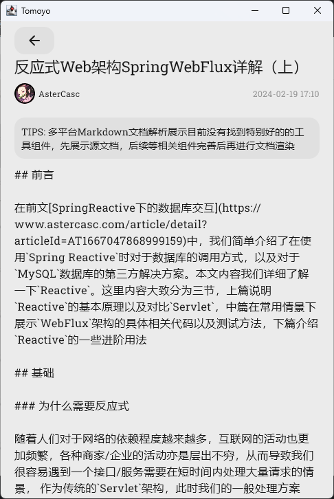
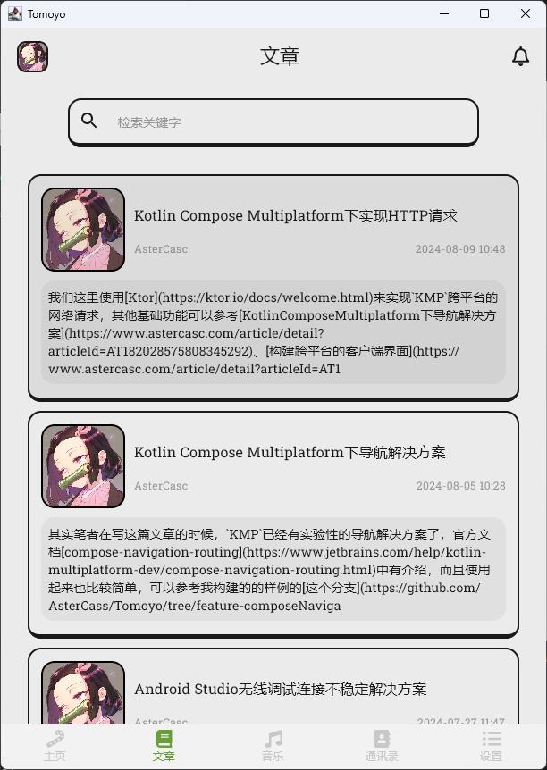
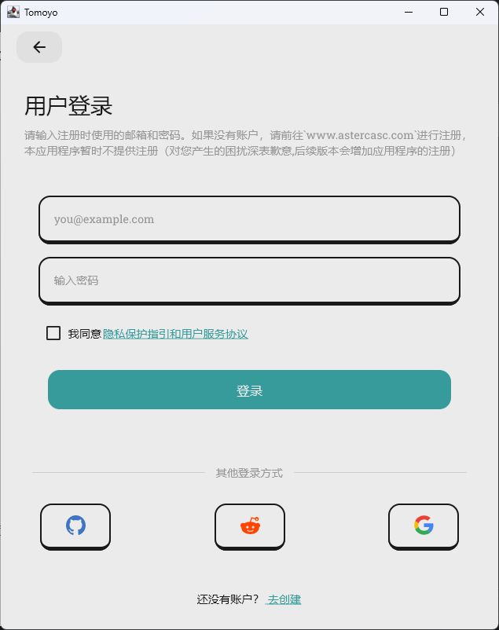
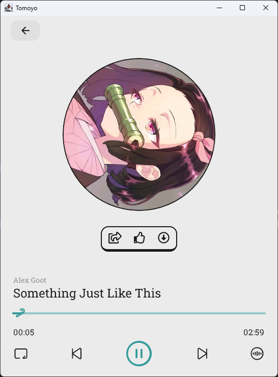

# Tomoyo App

## Introduction

Tomoyo is a Kotlin Multiplatform app.
On one hand, it is a functional copy of [the website](https://www.astercasc.com), enabling some of
its features to be implemented on mobile and desktop platforms.
On the other hand, it serves as a sample for common functionalities such as navigation, socket
(for chat), video, audio, and db in Kotlin Multiplatform.

Tomoyo是一个Kotlin Multiplatform 应用程序
一方面它是一个对于[该网站](https://www.astercasc.com)的功能拷贝，让其中一些功能可以在移动端和桌面端实现。
另一方面它是一个Kotlin Multiplatform下导航，socket，视频，音频，存储等常用功能的使用用例

## WIP

> Please note that this project is still under development and some features may not work as
> expected.

> 请注意，此项目仍在开发中，某些功能可能无法按预期工作

## Platforms Support

| Android | IOS | Desktop/JVM | Web |
|:-------:|:---:|:-----------:|:---:|
|    √    |  ×  |      √      |  ×  |

## Screenshots

### Android

### Desktop

## Run Project

### Android

Open project in Android Studio and run

在Android Studio打开直接运行即可

### Desktop

Run command `./gradlew :composeApp:run`

执行命令`./gradlew :composeApp:run`

## Tech Stack

- [Kotlin Multiplatform](https://kotlinlang.org/lp/multiplatform/)
- [Compose Multiplatform](https://www.jetbrains.com/lp/compose-multiplatform/)
- [Kotlin Coroutines](https://github.com/Kotlin/kotlinx.coroutines)
- [Koin](https://insert-koin.io/)
- [Coil](https://coil-kt.github.io/coil/)
- [Ktor](https://ktor.io/)
- [Krossbow](https://github.com/joffrey-bion/krossbow)
- [Exoplayer](https://github.com/google/ExoPlayer)
- [Voyager](https://github.com/adrielcafe/voyager)
- [JavaFx](https://openjfx.io/)
- [Multiplatform Setting](https://github.com/russhwolf/multiplatform-settings)