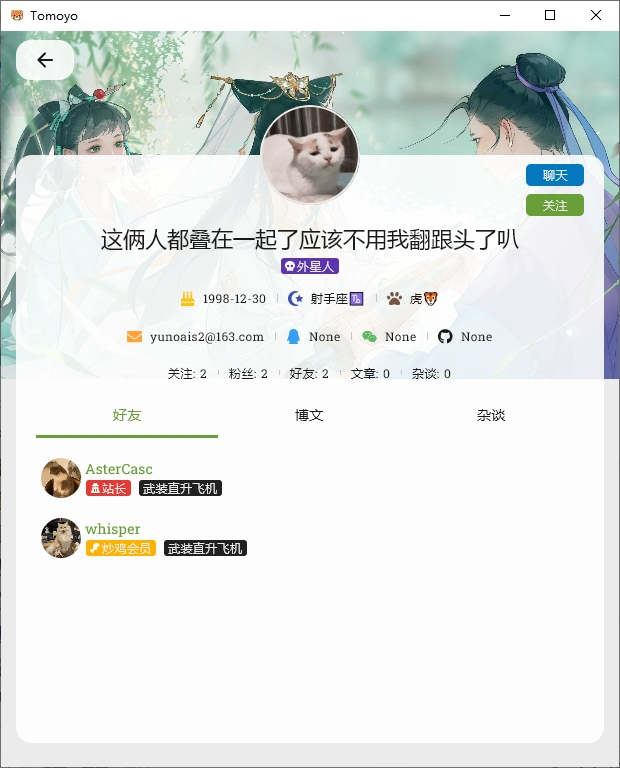

# Tomoyo App

English | [中文](README_zh.md)

## Introduction

Tomoyo is a Kotlin Multiplatform app.
On one hand, it is a functional copy of [the website](https://www.astercasc.com), enabling some of
its features to be implemented on mobile and desktop platforms.
On the other hand, it serves as a sample for common functionalities such as navigation, socket
(for chat), video, audio, and db in Kotlin Multiplatform.

## WIP

> Please note that this project is still under development and some features may not work as
> expected.

## Platforms Support

| Android | IOS | Desktop/JVM | Web |
|:-------:|:---:|:-----------:|:---:|
|    √    |  √   |      √      |  ×  |

## Documents

[Building cross-platform client interfaces](https://www.astercasc.com/article/detail?articleId=AT1734101922878869)

[Leverage Google Firebase to deliver system-level push notifications for Android apps](https://www.astercasc.com/article/detail?articleId=AT192764442002353766)

[Music playback solution in Kotlin Compose Multiplatform](https://www.astercasc.com/article/detail?articleId=AT182402577020566323)

[Implementing HTTP requests in Kotlin Compose Multiplatform](https://www.astercasc.com/article/detail?articleId=AT182174036963389030)

[Navigation solution in Kotlin Compose Multiplatform](https://www.astercasc.com/article/detail?articleId=AT182028575808345292)

[Global Notification Component Construction in Kotlin Compose Multiplatform](https://www.astercasc.com/article/detail?articleId=AT183303835787436441)

[Custom Fonts in Kotlin Compose Multiplatform](https://www.astercasc.com/article/detail?articleId=AT183482081114038681)

[Global Notification Component Construction in Kotlin Compose Multiplatform (Part II)](https://www.astercasc.com/article/detail?articleId=AT183632859813146214)

[Data Persistence Solutions in Kotlin Compose Multiplatform](https://www.astercasc.com/article/detail?articleId=AT183842512953804800)

[Socket Solutions in Kotlin Compose Multiplatform](https://www.astercasc.com/article/detail?articleId=AT184505260536629248)

## Screenshots

### Android

### Desktop

### IOS

## Important Tips

* About System-Level Push Notifications:
  * You need to follow this [tutorial](https://firebase.google.com/docs/cloud-messaging) for setup.
    Relevant client code has already been provided in
    the repository. However, for security reasons, the corresponding `google-services.json` file is
    not included.
    If you need similar functionality for your own development, you can replace the file and refer
    to the related message handling logic.
    However, it will not be possible to interoperate with the default backend server and receive
    messages from other users or groups within `Tomoyo`.
  * The current client/server strategy is:
    As long as a message is generated and the user is not logged in on the web or desktop side, an
    FCM push will be sent to the user's mobile device.
    For use cases involving many users, it is recommended to sync the user's activity status from
    the mobile app to the server, and only send push notifications when the client is inactive.
    Additionally, FCM usage can be reduced by message aggregation (e.g., sending only the latest
    message every N seconds per user/group to avoid message flooding).
  * Currently, I has only tested this on three mobile devices. Testing on more devices is
    not possible due to limited resources.
    If you are not receiving push notifications:
    * First check whether the device is allowed to access the internet;
    * Then check whether the Google Play Store app is installed.
      These are not strictly required, but some phone models may depend on them.
      If you are unable to receive FCM messages or this method is not acceptable for your use case,
      consider using the vendor-specific push platforms (e.g., HarmonyOS Push, Xiaomi Push), or
      third-party platforms such as JPush or Getui.
  * Regarding system-level push notifications, requirements vary by phone manufacturer. In general,
    notifications need to be enabled, auto-start should be allowed, and the app's battery
    optimization settings may need to be adjusted.
  * The iOS version of this feature is not implemented due to the lack of a developer account, but
    the logic will be the same as on Android.

## Run Project

### Android

Open project in Android Studio and run

### Desktop

Run command `./gradlew :composeApp:run`

### IOS

[Run your application on iOS](https://www.jetbrains.com/help/kotlin-multiplatform-dev/multiplatform-create-first-app.html#run-your-application-on-ios)

#### TIPS 

* If you encounter `nw_proxy_resolver_create_parsed_array [C5.1 proxy pac] Evaluation error: NSURLErrorDomain: -1004`, please disable the proxy on your iPhone or the computer where the simulator is running

## Tech Stack

- [Kotlin Multiplatform](https://kotlinlang.org/lp/multiplatform/)
- [Compose Multiplatform](https://www.jetbrains.com/lp/compose-multiplatform/)
- [Kotlin Coroutines](https://github.com/Kotlin/kotlinx.coroutines)
- [Koin](https://insert-koin.io/)
- [Sketch](https://github.com/panpf/sketch/)
- [zoomimage](https://github.com/panpf/zoomimage)
- [FileKit](https://github.com/vinceglb/FileKit)
- [Ktor](https://ktor.io/)
- [Krossbow](https://github.com/joffrey-bion/krossbow)
- [Exoplayer](https://github.com/google/ExoPlayer)
- [Voyager](https://github.com/adrielcafe/voyager)
- [JavaFx](https://openjfx.io/)
- [Multiplatform Setting](https://github.com/russhwolf/multiplatform-settings)