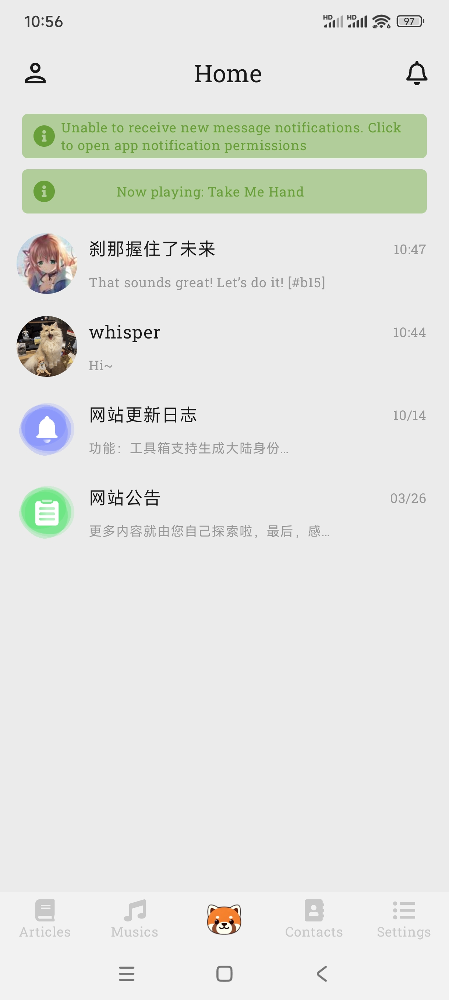

# Tomoyo App

English | [中文](README_zh.md)

## Introduction

Tomoyo is a Kotlin Multiplatform app.
On one hand, it is a functional copy of [the website](https://www.astercasc.com), enabling some of
its features to be implemented on mobile and desktop platforms.
On the other hand, it serves as a sample for common functionalities such as navigation, socket
(for chat), video, audio, and db in Kotlin Multiplatform.

## WIP

> Please note that this project is still under development and some features may not work as
> expected.

## Platforms Support

| Android | IOS | Desktop/JVM | Web |
|:-------:|:---:|:-----------:|:---:|
|    √    |  √   |      √      |  ×  |

## Documents

[Building cross-platform client interfaces](https://www.astercasc.com/article/detail?articleId=AT1734101922878869)

[Leverage Google Firebase to deliver system-level push notifications for Android apps](https://www.astercasc.com/article/detail?articleId=AT192764442002353766)

[Music playback solution in Kotlin Compose Multiplatform](https://www.astercasc.com/article/detail?articleId=AT182402577020566323)

[Implementing HTTP requests in Kotlin Compose Multiplatform](https://www.astercasc.com/article/detail?articleId=AT182174036963389030)

[Navigation solution in Kotlin Compose Multiplatform](https://www.astercasc.com/article/detail?articleId=AT182028575808345292)

[Global Notification Component Construction in Kotlin Compose Multiplatform](https://www.astercasc.com/article/detail?articleId=AT183303835787436441)

[Custom Fonts in Kotlin Compose Multiplatform](https://www.astercasc.com/article/detail?articleId=AT183482081114038681)

[Global Notification Component Construction in Kotlin Compose Multiplatform (Part II)](https://www.astercasc.com/article/detail?articleId=AT183632859813146214)

[Data Persistence Solutions in Kotlin Compose Multiplatform](https://www.astercasc.com/article/detail?articleId=AT183842512953804800)

[Socket Solutions in Kotlin Compose Multiplatform](https://www.astercasc.com/article/detail?articleId=AT184505260536629248)

## Screenshots

### Android

### Desktop

### IOS

## Important Tips

* Regarding system-level message push notifications:
  Processing should follow [this tutorial](https://firebase.google.com/docs/cloud-messaging).
  Relevant client-side code is already provided in the repository. However, due to security
  considerations, the corresponding `google-services.json` file is not included. If you need to
  develop similar functionality for reference, you may replace it and adapt the relevant messaging
  logic. Note that it will not be able to interact with the default server to receive messages from
  other users or groups in `Tomoyo`.
* About the current strategy for system-level message push notifications:
  The current client/server policy is that whenever there is a message and the user is not logged in
  via the web or desktop client, messages are delivered to the user's mobile client via FCM. For
  scenarios with a large number of users, you may:
  * Synchronize active status from the mobile client to the server, and only trigger push
    notifications when the client is inactive.
  * Reduce FCM usage through message batching (e.g., sending only the last message to each
    user/group every N seconds to avoid short-term message overload).
* Notes on testing system-level message push notifications:
  Testing has been completed on the author's three mobile devices. More devices could not be tested
  due to limited resources. If message delivery fails:
  * First verify whether the device can access internet networks.
  * Check if Google Play Services is installed (not mandatory, but may be required for certain phone
    models)
* If FCM-based messaging cannot be implemented or is unacceptable for your business needs, consider
  using:
  * Manufacturer-provided push platforms (e.g., Huawei/Honor Push, Xiaomi Push)
  * Third-party push platforms (e.g., JPush, Getui).
* Regarding system-level message push notifications:
  Requirements vary across different mobile manufacturers. Generally, users need to enable
  notifications, grant auto-start permissions, and adjust the app's battery optimization settings (
  to prevent the system from restricting background activity).

## Run Project

### Android

Open project in Android Studio and run

### Desktop

Run command `./gradlew :composeApp:run`

### IOS

[Run your application on iOS](https://www.jetbrains.com/help/kotlin-multiplatform-dev/multiplatform-create-first-app.html#run-your-application-on-ios)

#### TIPS 

* If you encounter `nw_proxy_resolver_create_parsed_array [C5.1 proxy pac] Evaluation error: NSURLErrorDomain: -1004`, please disable the proxy on your iPhone or the computer where the simulator is running

## Tech Stack

- [Kotlin Multiplatform](https://kotlinlang.org/lp/multiplatform/)
- [Compose Multiplatform](https://www.jetbrains.com/lp/compose-multiplatform/)
- [Kotlin Coroutines](https://github.com/Kotlin/kotlinx.coroutines)
- [Koin](https://insert-koin.io/)
- [Sketch](https://github.com/panpf/sketch/)
- [zoomimage](https://github.com/panpf/zoomimage)
- [FileKit](https://github.com/vinceglb/FileKit)
- [Ktor](https://ktor.io/)
- [Krossbow](https://github.com/joffrey-bion/krossbow)
- [Exoplayer](https://github.com/google/ExoPlayer)
- [Voyager](https://github.com/adrielcafe/voyager)
- [JavaFx](https://openjfx.io/)
- [Multiplatform Setting](https://github.com/russhwolf/multiplatform-settings)