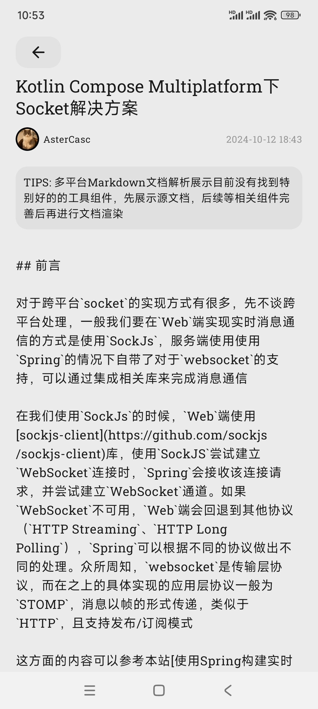

# Tomoyo App

## Introduction

Tomoyo is a Kotlin Multiplatform app.
On one hand, it is a functional copy of [the website](https://www.astercasc.com), enabling some of
its features to be implemented on mobile and desktop platforms.
On the other hand, it serves as a sample for common functionalities such as navigation, socket
(for chat), video, audio, and db in Kotlin Multiplatform.

Tomoyo是一个Kotlin Multiplatform 应用程序
一方面它是一个对于[该网站](https://www.astercasc.com)的功能拷贝，让其中一些功能可以在移动端和桌面端实现。
另一方面它是一个Kotlin Multiplatform下导航，socket，视频，音频，存储等常用功能的使用用例

## WIP

> Please note that this project is still under development and some features may not work as
> expected.

> 请注意，此项目仍在开发中，某些功能可能无法按预期工作

## Platforms Support

| Android | IOS | Desktop/JVM | Web |
|:-------:|:---:|:-----------:|:---:|
|    √    |  √   |      √      |  ×  |

## Documents

[Music playback solution in Kotlin Compose Multiplatform/Kotlin Compose Multiplatform下音乐播放解决方案](https://www.astercasc.com/article/detail?articleId=AT182402577020566323)

[Implementing HTTP requests in Kotlin Compose Multiplatform/Kotlin Compose Multiplatform下实现HTTP请求](https://www.astercasc.com/article/detail?articleId=AT182174036963389030)

[Navigation solution in Kotlin Compose Multiplatform/Kotlin Compose Multiplatform下导航解决方案](https://www.astercasc.com/article/detail?articleId=AT182028575808345292)

[Building cross-platform client interfaces/构建跨平台的客户端界面](https://www.astercasc.com/article/detail?articleId=AT1734101922878869)

[Global Notification Component Construction in Kotlin Compose Multiplatform/Kotlin Compose Multiplatform下全局通知组件构建](https://www.astercasc.com/article/detail?articleId=AT183303835787436441)

[Custom Fonts in Kotlin Compose Multiplatform/Kotlin Compose Multiplatform下自定义字体](https://www.astercasc.com/article/detail?articleId=AT183482081114038681)

[Global Notification Component Construction in Kotlin Compose Multiplatform (Part II)/Kotlin Compose Multiplatform下全局通知组件构建（续篇）](https://www.astercasc.com/article/detail?articleId=AT183632859813146214)

[Data Persistence Solutions in Kotlin Compose Multiplatform/Kotlin Compose Multiplatform下数据持久化解决方案](https://www.astercasc.com/article/detail?articleId=AT183842512953804800)

[Socket Solutions in Kotlin Compose Multiplatform/Kotlin Compose Multiplatform下Socket解决方案](https://www.astercasc.com/article/detail?articleId=AT184505260536629248)

## Screenshots

### Android

### Desktop

### IOS

## Important Tips

* If you need to test the system-level application notification functionality, please follow [this tutorial](https://firebase.google.com/docs/cloud-messaging). The relevant client-side code is already provided in the repository. However, for security reasons, the corresponding `google-services.json` file is not included. If you are developing a similar feature and wish to use this as a reference, you can replace the file with your own and refer to the related messaging logic. However, it will not be possible to interact with the default server to receive messages from other users or groups within `Tomoyo`

* 如果需要测试系统级应用程序通知功能，需要按照[该教程](https://firebase.google.com/docs/cloud-messaging)处理，相关客户端代码仓库中已经给出。但出于安全考虑，并没有没有提供对应的`google-services.json`文件，如果您有相似的功能需要开发借鉴，可以将其替换，并参考相关消息逻辑，但是无法和默认的服务端进行消息联动进而收到在`Tomoyo`中其他用户或者群组中发来的消息

## Run Project

### Android

Open project in Android Studio and run

在Android Studio打开直接运行即可

### Desktop

Run command `./gradlew :composeApp:run`

执行命令`./gradlew :composeApp:run`

### IOS

[Run your application on iOS](https://www.jetbrains.com/help/kotlin-multiplatform-dev/multiplatform-create-first-app.html#run-your-application-on-ios)

#### TIPS 

* If you encounter `nw_proxy_resolver_create_parsed_array [C5.1 proxy pac] Evaluation error: NSURLErrorDomain: -1004`, please disable the proxy on your iPhone or the computer where the simulator is running

* 如果遇到`nw_proxy_resolver_create_parsed_array [C5.1 proxy pac] Evaluation error: NSURLErrorDomain: -1004`请关闭苹果手机代理或者模拟器所在电脑的代理

## Tech Stack

- [Kotlin Multiplatform](https://kotlinlang.org/lp/multiplatform/)
- [Compose Multiplatform](https://www.jetbrains.com/lp/compose-multiplatform/)
- [Kotlin Coroutines](https://github.com/Kotlin/kotlinx.coroutines)
- [Koin](https://insert-koin.io/)
- [Sketch](https://github.com/panpf/sketch/)
- [zoomimage](https://github.com/panpf/zoomimage)
- [FileKit](https://github.com/vinceglb/FileKit)
- [Ktor](https://ktor.io/)
- [Krossbow](https://github.com/joffrey-bion/krossbow)
- [Exoplayer](https://github.com/google/ExoPlayer)
- [Voyager](https://github.com/adrielcafe/voyager)
- [JavaFx](https://openjfx.io/)
- [Multiplatform Setting](https://github.com/russhwolf/multiplatform-settings)