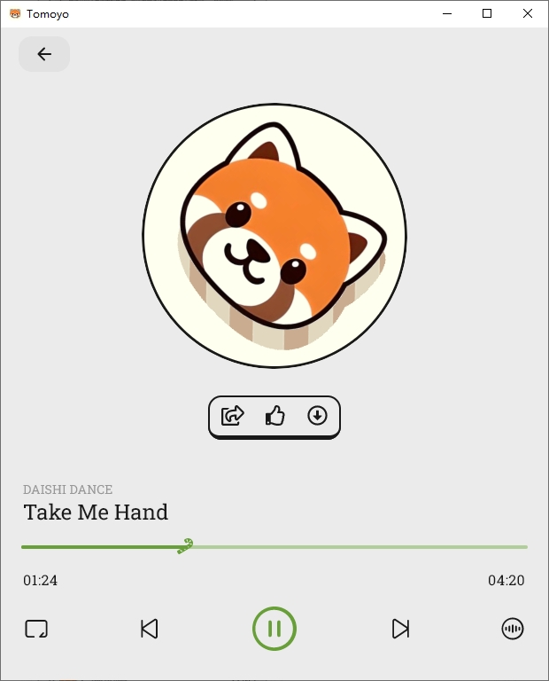

# Tomoyo App

[English](README.md) | 中文

## 介绍

Tomoyo是一个Kotlin Multiplatform 应用程序
一方面它是一个对于[该网站](https://www.astercasc.com)的功能拷贝，让其中一些功能可以在移动端和桌面端实现。
另一方面它是一个Kotlin Multiplatform下导航，socket，视频，音频，存储等常用功能的使用用例

## 进行中

> 请注意，此项目仍在开发中，某些功能可能无法按预期工作

## 平台支持

| Android | IOS | Desktop/JVM | Web |
|:-------:|:---:|:-----------:|:---:|
|    √    |  √  |      √      |  ×  |

## 文档

[构建跨平台的客户端界面](https://www.astercasc.com/article/detail?articleId=AT1734101922878869)

[利用GoogleFirebase为安卓应用提供系统级消息通知](https://www.astercasc.com/article/detail?articleId=AT192764442002353766)

[Kotlin Compose Multiplatform下音乐播放解决方案](https://www.astercasc.com/article/detail?articleId=AT182402577020566323)

[Kotlin Compose Multiplatform下实现HTTP请求](https://www.astercasc.com/article/detail?articleId=AT182174036963389030)

[Kotlin Compose Multiplatform下导航解决方案](https://www.astercasc.com/article/detail?articleId=AT182028575808345292)

[Kotlin Compose Multiplatform下全局通知组件构建](https://www.astercasc.com/article/detail?articleId=AT183303835787436441)

[Kotlin Compose Multiplatform下自定义字体](https://www.astercasc.com/article/detail?articleId=AT183482081114038681)

[Kotlin Compose Multiplatform下全局通知组件构建（续篇）](https://www.astercasc.com/article/detail?articleId=AT183632859813146214)

[Kotlin Compose Multiplatform下数据持久化解决方案](https://www.astercasc.com/article/detail?articleId=AT183842512953804800)

[Kotlin Compose Multiplatform下Socket解决方案](https://www.astercasc.com/article/detail?articleId=AT184505260536629248)

## 截图

### 安卓

### 桌面

### 苹果

## 重要提示

* 关于系统级消息推送，需要按照[该教程](https://firebase.google.com/docs/cloud-messaging)
  处理，相关客户端代码仓库中已经给出。但出于安全考虑，并没有没有提供对应的`google-services.json`
  文件，如果您有相似的功能需要开发借鉴，可以将其替换，并参考相关消息逻辑，但是无法和默认的服务端进行消息联动，进而收到在
  `Tomoyo`中其他用户或者群组中发来的消息 
* 关于系统级消息推送，目前客户端/服务端的策略是，只要有消息且该用户没有在web端或者桌面端登录，都走FCM推送该用户的移动端。如果对于使用人数较多的场景下，可以通过移动端将活跃状态同步到服务端，只有在客户端不活跃的情况下，才进行消息推送。同时也可以通过消息合并（即对于每个/组用户每隔N秒发送最后一条消息，避免短期消息爆炸）等方式减少FCM的使用 
* 关于系统级消息推送，目前作者有的三台移动设备测试完成，其他更多移动设备没有条件测试，如果消息推送无法收到，请检测首先是否允许访问外网，其次是否包含谷歌商店应用，这两者不是必须的，但是对于某个手机型号可能需要。如果无论如何也无法利用FCM发送消息，或者这种方式不能被业务接受，可以尝试使用移动设备所在的厂商提供的消息推送平台，或者其他第三方平台
* 关于系统级消息推送，不同手机厂商需求不同，一般需要打开通知，以及自启动，以及调整应用程序省电策略

## 运行项目

### 安卓

在Android Studio打开直接运行即可

### 桌面

执行命令`./gradlew :composeApp:run`

### 苹果

[示例](https://www.jetbrains.com/help/kotlin-multiplatform-dev/multiplatform-create-first-app.html#run-your-application-on-ios)

#### 提示

* 如果遇到
  `nw_proxy_resolver_create_parsed_array [C5.1 proxy pac] Evaluation error: NSURLErrorDomain: -1004`
  请关闭苹果手机代理或者模拟器所在电脑的代理

## 技术栈

- [Kotlin Multiplatform](https://kotlinlang.org/lp/multiplatform/)
- [Compose Multiplatform](https://www.jetbrains.com/lp/compose-multiplatform/)
- [Kotlin Coroutines](https://github.com/Kotlin/kotlinx.coroutines)
- [Koin](https://insert-koin.io/)
- [Sketch](https://github.com/panpf/sketch/)
- [zoomimage](https://github.com/panpf/zoomimage)
- [FileKit](https://github.com/vinceglb/FileKit)
- [Ktor](https://ktor.io/)
- [Krossbow](https://github.com/joffrey-bion/krossbow)
- [Exoplayer](https://github.com/google/ExoPlayer)
- [Voyager](https://github.com/adrielcafe/voyager)
- [JavaFx](https://openjfx.io/)
- [Multiplatform Setting](https://github.com/russhwolf/multiplatform-settings)